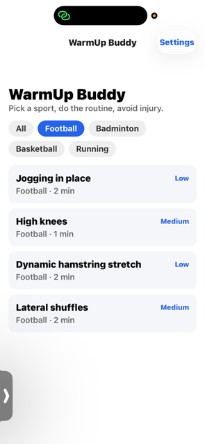
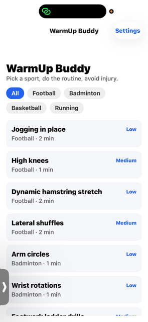
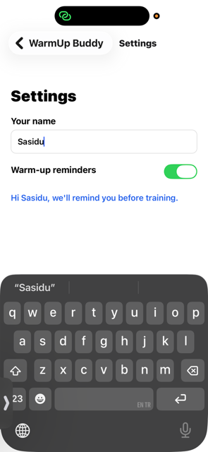

# WarmUp Buddy

## 1. Target Domain
**Sports & Fitness**

## 2. Problem Statement
Amateur and casual athletes frequently skip or rush warm-ups before training or matches
because they don't know a proper, sport-specific routine — leading to a higher risk of
strains and injuries. Generic fitness apps focus on full workouts or calorie tracking,
not the short, targeted warm-up phase that happens *right before* play.

## 3. How the App Solves It
- **Home screen**: Browse warm-up exercises grouped by sport (Football, Badminton,
  Basketball, Running) in a scrollable list, filterable by sport using quick-select chips.
- **Detail screen**: Tap any exercise to see its duration, intensity, and a short
  description of proper form/purpose, then mark it as done to track warm-up progress
  before a session.
- **Settings screen**: Save your name and toggle warm-up reminders, so the app feels
  personalised to the user.

Together, these features turn "I don't know what to do before I play" into a guided,
sport-specific checklist that takes a few minutes to complete.

## App Name
**WarmUp Buddy**

## Tech Stack
- React Native (Expo)
- React Navigation (native-stack)

## Setup Instructions
1. Install dependencies:
   ```bash
   npm install
   ```
2. Start the Expo dev server:
   ```bash
   npx expo start
   ```
3. Scan the QR code with **Expo Go** (Android) or run on an emulator:
   ```bash
   npx expo start --android
   ```

## Screens
1. **Home** — FlatList of 14 warm-up exercises across 4 sports, with sport filter chips.
2. **Detail** — Full exercise info (duration, intensity, description) + "Mark as Done" toggle.
3. **Settings** — User name input + reminders switch.

## State Management
- `HomeScreen`: `useState` for the selected sport filter (re-filters the FlatList).
- `DetailScreen`: `useState` for whether the current exercise is marked complete.
- `SettingsScreen`: `useState` for the name text input and the reminders switch.

## Screenshots
_(Add screenshots of Home, Detail, and Settings screens here before submission.)_

| Home | Detail | Settings |
|------|--------|----------|
|  |  |  |

## Author Notes
This project was scaffolded with AI assistance for structure and boilerplate, then
customized, tested, and understood component-by-component by the author for the
Sprint 1 submission of CSI2114 Mobile Application Development.
